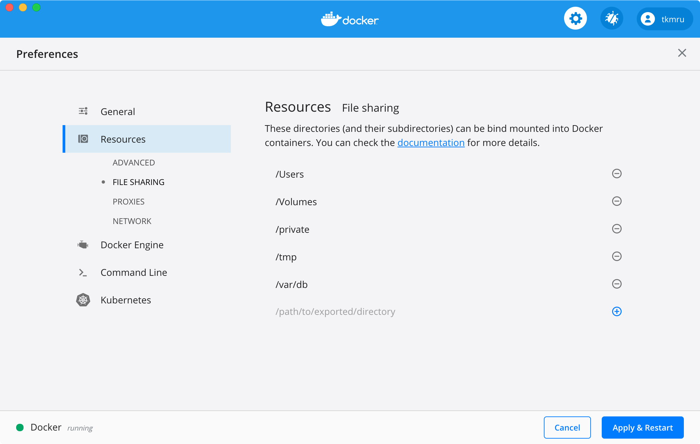

# Greenbone Vulnerability Management in Docker

It was created by forking [dgiorgio/gvm-docker](https://github.com/dgiorgio/gvm-docker).

### How to use this image

In order to match the time in the Docker container with the host's time, the host's `/etc/localtime` is mounted on the container's `/etc/localtime`.
However, in macOS version of Docker, you need to specify `/var/db/timezone/zoneinfo/Asia/Tokyo` for the host path, not `/etc/localtime`.
There is also a Dockerfile with a modified path for macOS.
If you're using macOS, switch branches to [for-mac](https://github.com/tkmru/gvm-docker/tree/for-mac) branch.

Also, if you are using macOS, you need to add `/var/db` to the shared folder.



#### Run with docker-compose
```console
$ cd gvm-docker/docker-compose/stable
$ docker-compose -p gvm -f docker-compose.yml up -d
```
or
#### Run docker-compose with ansible
```console
$ cd ansible-gvm
$ ansible-playbook start_gvm.yml
```

## License

This Docker image is licensed under the BSD, see [LICENSE](LICENSE.md).
